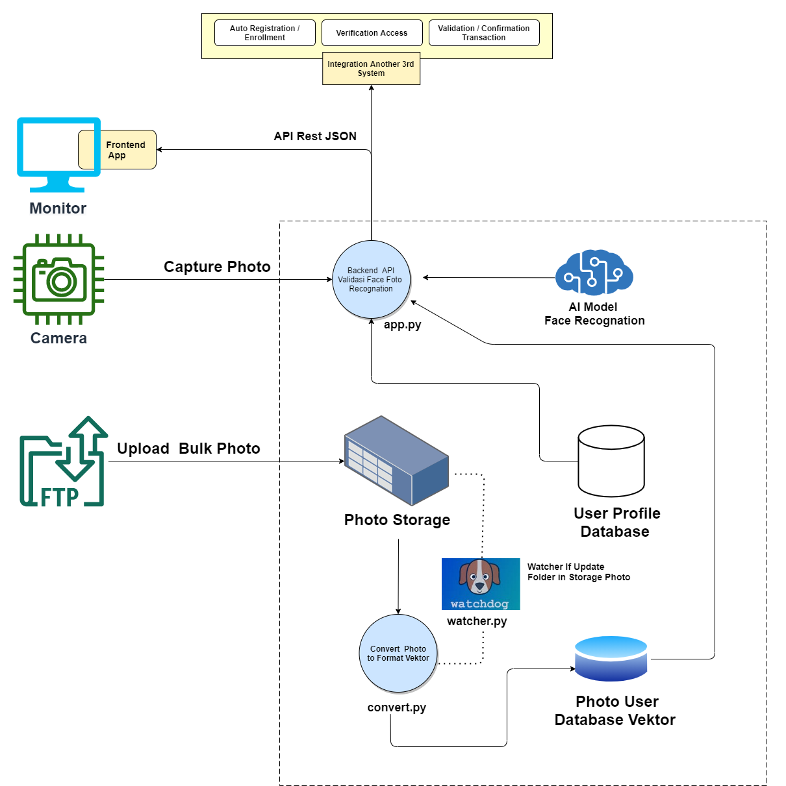
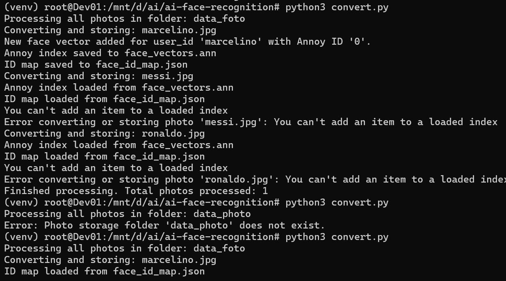
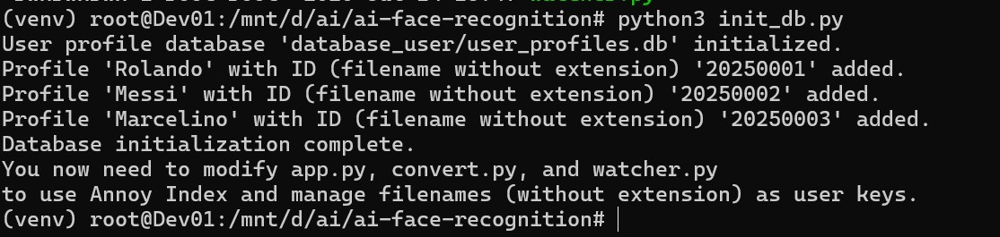

Imagine a system that not only sees, but truly recognizes. A system capable of identifying individuals with precision, opening doors to enhanced security, personalization, automatic registration / enrollment, validation transaction. This is the architectural story behind your face recognition system, a journey of biometric data from raw images to verified identities.

Core System Flow:
1. Photo Capture: The Initial Data Gateway

Every journey begins with an image. In this system, there are two main ways face photos enter the ecosystem:

Real-time Verification via Camera: For instant verification needs, such as access control or check-ins, the system can capture photos directly through a Camera. This acts as your system's eyes on the ground.

Bulk Registration via FTP: To manage a large user database, photos can be uploaded collectively as Bulk Photos via FTP. These photos then land securely in Photo Storage, awaiting processing.

2. Face Conversion and Indexing: From Pixels to Smart Vectors

This is the heart of your system's recognition capability, where images are transformed into biometric data that machines can understand:

Automated Gatekeeper (Watcher): As soon as a new or updated photo arrives in Photo Storage, the Watcher (watcher.py), running in the background (often in environments like Python3 for stability and compatibility), immediately detects it. The Watcher acts as an automated gatekeeper, ensuring no photo is missed.

Vector Factory (Convert.py): Once detected, the Watcher triggers Convert Photo to Format Vector (convert.py). This is where the AI magic begins:

Face Detection with MTCNN: First, convert.py uses the MTCNN (Multi-task Cascaded Convolutional Networks) model. MTCNN's job is to accurately find face locations within the image and crop them, ensuring only relevant faces are processed.

Feature Extraction with FaceNet: The detected faces are then fed into the AI Model Face Recognition, specifically FaceNet. FaceNet is an advanced deep learning model that transforms each face into a unique set of numbers, or what we call feature vectors (embeddings). These vectors are the biometric "digital fingerprints" of the faces.

Fast Storage with Annoy: These feature vectors are then stored in the User Photo Vector Database. To ensure incredibly fast searches among millions of vectors, this database is indexed using Annoy Index. Annoy is an Approximate Nearest Neighbors library designed for high-speed similarity searches.

User Profile Integration: Each vector stored in Annoy has a unique ID (Annoy ID). This ID is also updated in the User Profile Database (initially set up by init_db.py), linking the face vector to the user's personal data (name, email, etc.).

3. Face Recognition and Verification: The Moment of Truth

When it's time to recognize someone, the system works quickly and intelligently:

Requests from the Outside World: Whether it's your developed Frontend App or another Third-Party System, they interact with this system via a REST JSON API. This is the universal language that allows various applications to communicate with your face recognition system.

Operational Brain (app.py): When a photo is uploaded to the API for verification, the Backend API (app.py) is the first to receive it.

    Real-time Vector Extraction: Similar to convert.py, app.py also uses MTCNN to detect faces and FaceNet to extract feature vectors from the newly uploaded photo. Consistency in using these models is crucial for accuracy.

    Fast Similarity Search: The newly extracted vector is then directly sent to the User Photo Vector Database (indexed by Annoy Index) to find the most similar vectors.

    Accuracy Assessment: The result is a similarity score (e.g., Cosine Similarity) indicating how closely the uploaded face matches faces stored in the database. If this score exceeds a certain threshold, the system considers it a biometric match.

    Profile Details: If a match is found, app.py retrieves the complete user profile details from the User Profile Database and returns them via the API, providing a rich and informative response.

4. Automated Registration: Seamless Enrollment with Face Recognition

Beyond just recognizing, this system can also facilitate automatic registration of new users simply by providing their photo. This streamlines the enrollment process, making it more intuitive and efficient:

New User Photo Submission: A new user's photo is introduced to the system, typically through the Photo Storage folder (e.g., via FTP or a manual upload process that places the file there). The filename should ideally correspond to a unique user identifier (e.g., newuser_id.jpg).

Watcher's Role in Registration: The Watcher (watcher.py), constantly monitoring Photo Storage, detects this new photo. It then triggers Convert Photo to Format Vector (convert.py) for this new entry.

Vector Creation and Database Update: convert.py processes this new photo:

    It uses MTCNN and FaceNet to extract the unique biometric feature vector for the new face.

    This new vector is then added to the User Photo Vector Database (Annoy Index), receiving a new Annoy ID.

    Crucially, the convert.py script also updates the User Profile Database. If a user profile with the corresponding user_id (from the filename) doesn't exist, convert.py can automatically insert a new user record into the users table, linking it with the newly generated face_id (Annoy ID). This creates a new profile for the registered face.

Verification for New Registrations: Once the photo is processed and the profile/vector updated, the new user's face is now part of the recognition system. Subsequent verification attempts will be able to identify them.

This automated registration process minimizes manual data entry and leverages the core face recognition pipeline to seamlessly enroll new individuals into the system.
Key Technologies: The Foundation of Your System

This system is built upon a strong foundation of modern technologies:

MTCNN (Multi-task Cascaded Convolutional Networks): An efficient deep learning model for face detection and alignment, ensuring accurate faces for feature extraction.

FaceNet: A Convolutional Neural Network (CNN) architecture that generates high-dimensional face embeddings. This is the unique biometric "digital fingerprint" of each face.

Annoy (Approximate Nearest Neighbors Oh Yeah): A C++ library with Python bindings that is incredibly fast for finding nearest neighbors in high-dimensional spaces. Ideal for large-scale face vector similarity searches.

Python3: The primary programming language used to develop all backend scripts (watcher.py, convert.py, app.py), leveraging its rich AI ecosystem.

Flask: A Python web micro-framework used to build the Backend API (app.py), enabling easy RESTful communication.

SQLite: A lightweight database used for the User Profile Database, suitable for local data management and prototyping.

Watchdog: A Python library for monitoring file system changes in real-time, ensuring the automation of the conversion process.

This system is designed to enable automated face registration and fast, efficient biometric face verification, unlocking potential for various security and personalization applications.
Setup and Installation

To get this system up and running, follow these installation steps. These commands are typically run in a Linux environment (like WSL or a native Linux distribution).
1. Update System Packages

First, ensure your system's package list is up-to-date:

    sudo apt update

2. Install Essential Build Tools and Libraries

These packages provide necessary compilers, development tools, and core libraries required for building Python packages, especially those with C/C++ extensions (like dlib or parts of tensorflow and opencv-python):

    sudo apt install -y build-essential cmake pkg-config libx11-dev libopenblas-dev liblapack-dev libjpeg-dev libpng-dev libtiff-dev libavcodec-dev libavformat-dev libswscale-dev libv4l-dev libgtk-3-dev python3-dev python3-pip gfortran

    build-essential: Provides essential compilers (gcc, g++).

    cmake: Build system generator.

    pkg-config: Helps configure compilation flags for libraries.

    libx11-dev, libgtk-3-dev: Libraries for GUI and display, often needed by OpenCV.

    libopenblas-dev, liblapack-dev, gfortran: Optimized linear algebra libraries and Fortran compiler, crucial for numerical computations (used by NumPy, SciPy, and often by deep learning frameworks).

    libjpeg-dev, libpng-dev, libtiff-dev: Image format libraries, needed by OpenCV.

    libavcodec-dev, libavformat-dev, libswscale-dev, libv4l-dev: Multimedia libraries, potentially needed by OpenCV for video stream processing.

    python3-dev, python3-pip: Python 3 development headers and pip package installer.

3. Install Python Dependencies

After installing system-level prerequisites, you can install the Python libraries using pip. It's highly recommended to use a virtual environment to manage your project's dependencies.

First, create and activate a virtual environment:

    python3 -m venv venv
    source venv/bin/activate # On Linux/WSL
# For Windows Command Prompt: venv\Scripts\activate.bat
# For Windows PowerShell: venv\Scripts\Activate.ps1

Then, install the Python libraries from a requirements.txt file:

pip install -r requirements.txt

You will need to create a requirements.txt file in your project's root directory. Here's an example of what it should contain:

# requirements.txt
    Flask
    numpy
    annoy
    opencv-python
    mtcnn
    keras-facenet
    tensorflow # Or tensorflow-gpu if you have a compatible NVIDIA GPU and setup

Note on TensorFlow:

    If you have an NVIDIA GPU and a properly configured CUDA Toolkit and cuDNN, you might want to install tensorflow-gpu (or just tensorflow if your version automatically includes GPU support). This will significantly speed up FaceNet operations.

    If you don't have a GPU or prefer to run on CPU, tensorflow (CPU-only version) is sufficient.

System Demonstration

Here are some screenshots demonstrating the system in action:
1. Running convert.py
   
   

This screenshot shows the convert.py process loading the FaceNet/MTCNN models and converting photos in data_foto into vectors, then storing them in the Annoy Index and updating the SQLite database.

2. Running app.py

   

This screenshot shows app.py running as a Flask server, ready to receive API requests for face recognition. You will see messages indicating that the FaceNet/MTCNN models have been loaded.

3. User Profile Database Structure (user_profiles.db)

   

A screenshot from a tool like DB Browser for SQLite showing the users table in user_profiles.db, displaying the id, name, email, and face_id columns populated after convert.py has run.

4. Sample Photo Data for Learning

Here are example photos used as reference data in the data_foto/ folder for the system to "learn":

   

5. API Response Example (/upload_photo)

   

A screenshot from Postman/Insomnia or another API testing tool, displaying the JSON response from the /upload_photo endpoint after uploading a photo. This response will indicate if a face was recognized, the matching user_id, the face_id in Annoy, the similarity_score, and the complete profile data.