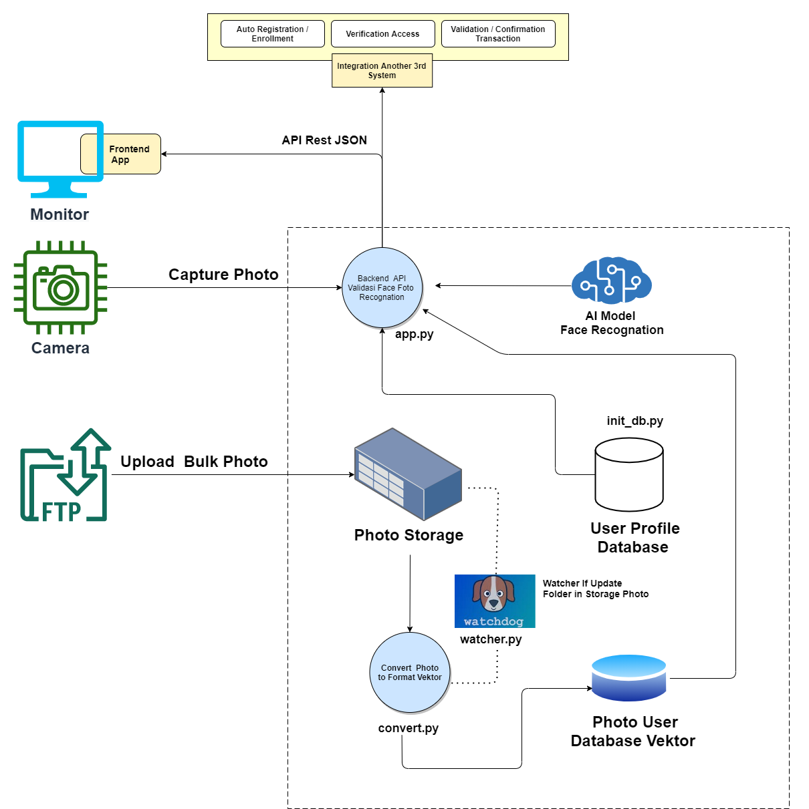
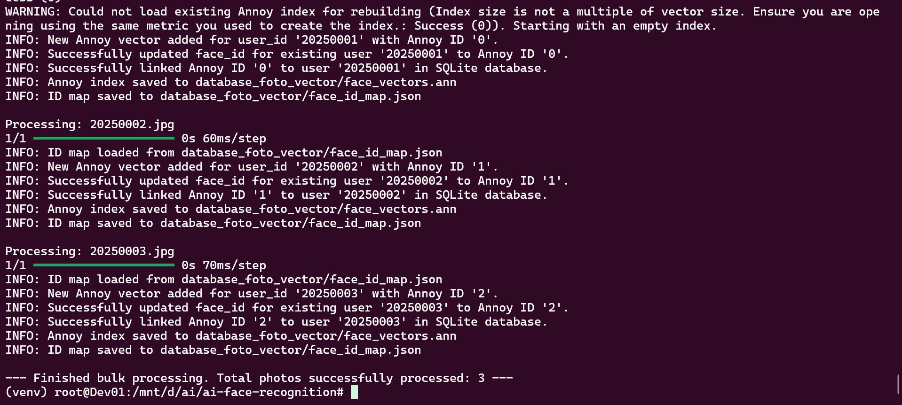
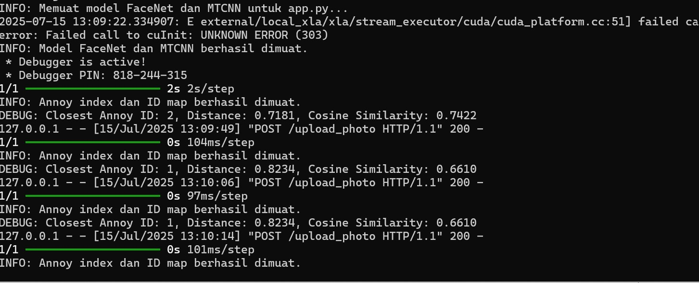

# The Architecture of Your Smart Face Recognition System

Imagine a system that not only sees, but truly recognizes. A system capable of identifying individuals with precision, opening doors to enhanced security, personalization, automatic registration / enrollment, validation transaction. This is the architectural story behind your face recognition system, a journey of biometric data from raw images to verified identities.

## Table of Contents

### A. Core System Flow: From Pixels to Verified Identities
1.  **Photo Capture: The Initial Data Gateway**
2.  **Face Conversion & Indexing: From Pixels to Smart Vectors**
3.  **Face Recognition & Verification: The Moment of Truth**
4.  **Automated Registration: Seamless Enrollment with Face Recognition**
5.  **Key Technologies: The Foundation of Your System**

### B. System & Environment Installation
1.  **Update System Packages**
2.  **Install Essential Build Tools and Libraries**
3.  **Install Python Dependencies (with Virtual Environment)**

### C. System Demonstration: Real-World Action
1.  **Running `convert.py`**
2.  **Running `app.py` (Backend API)**
3.  **User Profile Database Structure (`user_profiles.db`)**
4.  **Sample Photo Data for Learning**
5.  **API Response Example (`/upload_photo`)**

## A. Core System Flow

### **1. Photo Capture: The Initial Data Gateway**

Every journey begins with an image. In this system, there are two main ways face photos enter the ecosystem:

Real-time Verification via Camera: For instant verification needs, such as access control or check-ins, the system can capture photos directly through a Camera. This acts as your system's eyes on the ground.

Bulk Registration via FTP: To manage a large user database, photos can be uploaded collectively as Bulk Photos via FTP. These photos then land securely in Photo Storage, awaiting processing.

### **2. Face Conversion and Indexing: From Pixels to Smart Vectors**

This system transforms images into machine-readable biometric data. It starts with the Watcher, an automated gatekeeper that detects new photos. The Vector Factory then uses MTCNN to find faces and FaceNet to convert them into unique feature vectors (embeddings)—digital fingerprints. These vectors are stored in the User Photo Vector Database, indexed by Annoy for fast searches, and linked to user profiles via a unique Annoy I

### **3. Face Recognition and Verification: The Moment of Truth**

When it's time to recognize someone, the system works quickly and intelligently:

Requests from the Outside World: Whether it's your developed Frontend App or another Third-Party System, they interact with this system via a REST JSON API. This is the universal language that allows various applications to communicate with your face recognition system.

###  **4. Automated Registration: Seamless Enrollment with Face Recognition**

Beyond just recognizing, this system can also facilitate automatic registration of new users simply by providing their photo. This streamlines the enrollment process, making it more intuitive and efficient:

New User Photo Submission: A new user's photo is introduced to the system, typically through the Photo Storage folder (e.g., via FTP or a manual upload process that places the file there). The filename should ideally correspond to a unique user identifier (e.g., newuser_id.jpg).

Watcher's Role in Registration: The Watcher (watcher.py), constantly monitoring Photo Storage, detects this new photo. It then triggers Convert Photo to Format Vector (convert.py) for this new entry.

Vector Creation and Database Update: convert.py processes this new photo:

    It uses MTCNN and FaceNet to extract the unique biometric feature vector for the new face.

    This new vector is then added to the User Photo Vector Database (Annoy Index), receiving a new Annoy ID.

    Crucially, the convert.py script also updates the User Profile Database. If a user profile with the corresponding user_id (from the filename) doesn't exist, convert.py can automatically insert a new user record into the users table, linking it with the newly generated face_id (Annoy ID). This creates a new profile for the registered face.

### **5. This system is built upon a strong foundation of modern technologies:**    

    MTCNN (Multi-task Cascaded Convolutional Networks): An efficient deep learning model for face detection and alignment, ensuring accurate faces for feature extraction.
    
    FaceNet: A Convolutional Neural Network (CNN) architecture that generates high-dimensional face embeddings. This is the unique biometric "digital fingerprint" of each face.
    
    Annoy (Approximate Nearest Neighbors Oh Yeah): A C++ library with Python bindings that is incredibly fast for finding nearest neighbors in high-dimensional spaces. Ideal for large-scale face vector similarity searches.
    
    Python3: The primary programming language used to develop all backend scripts (watcher.py, convert.py, app.py), leveraging its rich AI ecosystem.
    
    Flask: A Python web micro-framework used to build the Backend API (app.py), enabling easy RESTful communication.
    
    SQLite: A lightweight database used for the User Profile Database, suitable for local data management and prototyping.
    
    Watchdog: A Python library for monitoring file system changes in real-time, ensuring the automation of the conversion process.

This system is designed to enable automated face registration and fast, efficient biometric face verification, unlocking potential for various security and personalization applications.
Setup and Installation

## B. Install Lib Python

### **1. Update System Packages**
First, ensure your system's package list is up-to-date:

    sudo apt update

### **2. Install Essential Build Tools and Libraries**

These packages provide necessary compilers, development tools, and core libraries required for building Python packages, especially those with C/C++ extensions (like dlib or parts of tensorflow and opencv-python):

    sudo apt install -y build-essential cmake pkg-config libx11-dev libopenblas-dev liblapack-dev libjpeg-dev libpng-dev libtiff-dev libavcodec-dev libavformat-dev libswscale-dev libv4l-dev libgtk-3-dev python3-dev python3-pip gfortran

    build-essential: Provides essential compilers (gcc, g++).

    cmake: Build system generator.

    pkg-config: Helps configure compilation flags for libraries.

    libx11-dev, libgtk-3-dev: Libraries for GUI and display, often needed by OpenCV.

    libopenblas-dev, liblapack-dev, gfortran: Optimized linear algebra libraries and Fortran compiler, crucial for numerical computations (used by NumPy, SciPy, and often by deep learning frameworks).

    libjpeg-dev, libpng-dev, libtiff-dev: Image format libraries, needed by OpenCV.

    libavcodec-dev, libavformat-dev, libswscale-dev, libv4l-dev: Multimedia libraries, potentially needed by OpenCV for video stream processing.

    python3-dev, python3-pip: Python 3 development headers and pip package installer.

### **3. Install Python Dependencies**

After installing system-level prerequisites, you can install the Python libraries using pip. It's highly recommended to use a virtual environment to manage your project's dependencies.

First, create and activate a virtual environment:

    python3 -m venv venv
    source venv/bin/activate # On Linux/WSL

For Windows Command Prompt: venv\Scripts\activate.bat
For Windows PowerShell: venv\Scripts\Activate.ps1

Then, install the Python libraries from a requirements.txt file:

    pip install -r requirements.txt

You will need to create a requirements.txt file in your project's root directory. Here's an example of what it should contain:

requirements.txt
    Flask
    numpy
    annoy
    opencv-python
    mtcnn
    keras-facenet
    tensorflow # Or tensorflow-gpu if you have a compatible NVIDIA GPU and setup

## C. System Demonstration

Here are some screenshots demonstrating the system in action:
### **1. Running convert.py**   

   

This screenshot shows the convert.py process loading the FaceNet/MTCNN models and converting photos in data_foto into vectors, then storing them in the Annoy Index and updating the SQLite database.**

### 2. **Running app.py**
   
   

This screenshot shows app.py running as a Flask server, ready to receive API requests for face recognition. You will see messages indicating that the FaceNet/MTCNN models have been loaded.

### **3. User Profile Database Structure (user_profiles.db)**

   

A screenshot from a tool like DB Browser for SQLite showing the users table in user_profiles.db, displaying the id, name, email, and face_id columns populated after convert.py has run.

**4. Sample Photo Data for Learning**

Here are example photos used as reference data in the data_foto/ folder for the system to "learn":

   

### **5. API Response Example (/upload_photo)**

   

A screenshot from Postman/Insomnia or another API testing tool, displaying the JSON response from the /upload_photo endpoint after uploading a photo. This response will indicate if a face was recognized, the matching user_id, the face_id in Annoy, the similarity_score, and the complete profile data.
